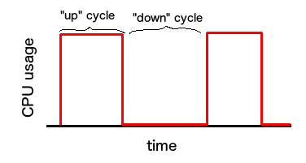

slow
====

Slow down a running process, CPU-wise. Send it the SIGSTOP and SIGCONT signals
in a loop, reducing its CPU usage per unit of time to a percentage of what it
would have been normally. The time interval when your target process is running is called the up cycle while the time interval when your target process is stopped is called the down cycle.

Crutially, the up cycles and down cycles can have different lengths, effectively providing a crude pulse-width modulation on the CPU budget of your process.

Note that the results observed are heavily dependent on the scheduling algorithm your OS uses, meaning that a certain set of parameters that work well on one system should not be taken to be portable to other systems, or even to different versions of the same system.

usage
=====

`slow <pid> <up> <down>`

pid is a process ID to which the CONT and STOP signals will be sent.

up is the length of the up cycle in milliseconds. It is an integer.

down is the length of the down cycle in milliseconds. It is an integer.

bugs
====

Please send me an email or make a pull request if you find a bug.